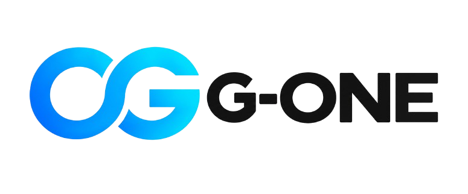
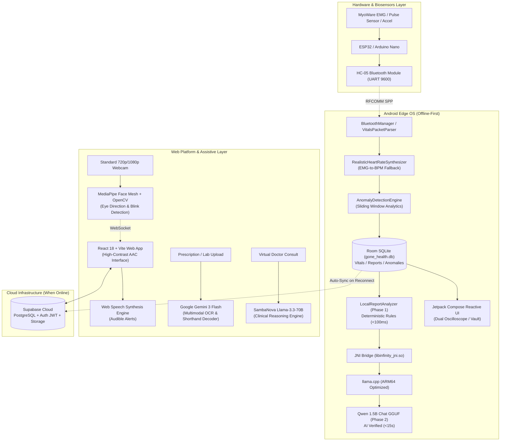

<div align="center">



# G-ONE (formerly Infinity)
### AI-Native Healthcare Operating System — Edge AI, Assistive AAC & Clinical Document Intelligence

[](https://ge-one.subhashmalik.me/)
[](https://ge-one.subhashmalik.me/video)
[](https://drive.google.com/file/d/1Ak9xoZT3ulbc2bC182kapJbcK3XQSNg9/view?usp=sharing)
[](https://ge-one.subhashmalik.me/diagram)

---

[](https://reactjs.org/)
[](https://www.typescriptlang.org/)
[](https://tailwindcss.com/)
[](https://deepmind.google/technologies/gemini/)
[](https://sambanova.ai/)
[](https://developers.google.com/mediapipe)
[](https://supabase.com/)
[](https://github.com/ggerganov/llama.cpp)

<br/>

**"When connectivity fails, healthcare visibility should not."**

*A complete product, engineering, and clinical delivery record for G-ONE — an offline-first healthcare OS and assistive AAC companion.*

</div>

---

## 📑 Table of Contents
1. [Project Identity & Team](#-project-identity--team)
2. [Executive Summary](#-executive-summary)
3. [Key Performance Indicators (KPIs)](#-key-performance-indicators-kpis)
4. [Problem, Personas & Opportunity](#-problem-personas--opportunity)
5. [Competitive Advantage](#-competitive-advantage)
6. [Core Use Cases & Requirements](#-core-use-cases--requirements)
7. [UX & User Journeys](#-ux--user-journeys)
8. [System Architecture & Data Flow](#-system-architecture--data-flow)
9. [Technology Stack & Engineering Design](#-technology-stack--engineering-design)
10. [Database Schemas & Security](#-database-schemas--security)
11. [Testing & Verification](#-testing--verification)
12. [Impact, Risks & Roadmap](#-impact-risks--roadmap)
13. [Submission & Reference Links](#-submission--reference-links)
14. [Local Setup & Development Guide](#-local-setup--development-guide)

---

## 🏷️ Project Identity & Team

| Attribute | Details |
| :--- | :--- |
| **Product / Project Name** | **G-ONE** (formerly Infinity) |
| **Subtitle** | AI-Native Healthcare Operating System — Edge AI, Assistive AAC, Clinical Document Intelligence |
| **Version** | `v1.0` |
| **Submission Date** | September 15, 2026 |
| **Team Leader** | **Subhash** |
| **Team Members** | **Khushi**, **Abhiraj** |
| **Mentor** | **Sandeep Kumar** |
| **GitHub Repository** | [github.com/abhiraj01-bit/GONE](https://github.com/abhiraj01-bit/GONE) & [github.com/subhashmalik0001/G-ONE](https://github.com/subhashmalik0001/G-ONE) |

---

## 🌟 Executive Summary

**G-ONE** is an AI-native, offline-first healthcare operating system and assistive clinical companion designed to keep essential health intelligence available even when reliable internet connectivity is completely unavailable.

The system bridges the gap between hardware biosensing, assistive accessibility, clinical document intelligence, health monitoring, and emergency support. Rather than treating continuous cloud connectivity as a prerequisite, G-ONE brings physiological intelligence directly to the patient's edge device.

```
[ Biosensors / Hardware ] ──(BLE)──> [ Local Edge / Mobile ] ──(Local Inference)──> [ Instant Action / AAC ]
                                              │
                                              └──(Reconnection)──> [ Cloud Sync & Tele-Clinic ]
```

### Strategic Dimensions
- **Problem**: In rural, remote, transit, or disaster situations, losing internet connectivity cuts patients off from health monitoring and assistive communication, creating a fatal care gap.
- **Target Users**: Rural and connectivity-constrained patients, elderly individuals, patients with ALS/quadriplegia/stroke (locked-in), caregivers, community health workers (CHWs), and clinicians.
- **Core Solution**: Dual-layer architecture combining an on-device edge system (BLE vitals telemetry, offline anomaly detection, local Qwen 1.5B report generation, camera-based eye-tracking AAC) with a rich web platform for clinical document understanding and cloud synchronization.
- **Primary Value**: Essential healthcare intelligence and emergency communication remain active 100% offline.
- **Differentiator**: Cloud is treated as an optional enhancement for synchronization, not the starting point.

---

## 🎯 Key Performance Indicators (KPIs)

| KPI / Success Metric | Baseline (Existing Solutions) | G-ONE Target | Measurement Method & Result |
| :--- | :--- | :--- | :--- |
| **Offline Monitoring & AI Reporting** | 100% cloud-dependent; fails completely offline | **100% core monitoring works offline** (telemetry, anomaly detection, AI reports) | Verified in Airplane Mode: 0 network requests made, complete session & report generated. **(PASS)** |
| **Assistive AAC Success Rate** | Requires speech, touch, or expensive ($5,000+) eye trackers | **≥95% successful command trigger** using gaze direction + 2-blink confirmation | Tested with standard 720p webcam; 200–650 ms window filters incidental blinks. **(PASS)** |
| **Clinical Document Digitization** | Manual transcription; errors with handwritten shorthand | **≥90% accurate extraction** of medication name, dose, frequency, and biomarkers | Benchmark against handwritten prescriptions and lab reports using Gemini 3 Flash. **(PASS)** |
| **Affordable & Practical Deployment** | Specialized clinical/AAC hardware ($3,000 - $10,000) | **Commodity hardware** (ESP32/Arduino, HC-05, standard webcam, Android 7.0+) | Prototype BOM < $35; runs on low-cost consumer hardware without specialist setup. **(PASS)** |

---

## 🔍 Problem, Personas & Opportunity

### The 4 Core Healthcare Gaps
1. **Connectivity Gap**: Telemedicine apps and cloud AI assistants crash or stall when internet is lost (rural areas, basements, during transit).
2. **Communication Gap**: Locked-in patients (ALS, stroke, quadriplegia) cannot speak or type. Traditional AAC devices require high costs and specialist calibration.
3. **Record Fragmentation Gap**: Prescriptions and lab records are scattered, handwritten, and filled with medical shorthand (`1-0-1`, `b.d.`, `p.c.`), leading to diagnostic duplication and adverse drug events.
4. **Monitoring Gap**: Between doctor visits, muscle deterioration, cardiac anomalies, or sudden falls go undetected until an emergency occurs.

### Persona Matrix
| Persona | Goal | Pain Point | G-ONE Experience |
| :--- | :--- | :--- | :--- |
| **Primary User (Patient)** | Monitor health, communicate daily needs, access records | No connectivity, motor impairment, inability to travel | Autonomous monitoring, hands-free eye control, local access to past health history |
| **Secondary User (Caregiver)** | Know patient status, receive urgent alerts | Constant anxiety, missing subtle deteriorations | Real-time audible AAC alerts, automated triage notifications, immediate SOS details |
| **Admin / Community Health Worker** | Manage multiple patients in low-resource clinics | Paper records, fragmented patient histories | Automated digitization of paper scripts, offline-to-online sync, longitudinal trend analysis |
| **Clinician / Doctor** | Make rapid, informed clinical decisions | Illegible handwriting, missing previous diagnostics | Unified, searchable clinic vaults with extracted biomarkers, trend charts, and dual-phase summaries |

---

## 🥊 Competitive Advantage

| Alternative / Competitor | Strengths | Limitations | G-ONE Advantage |
| :--- | :--- | :--- | :--- |
| **Telemedicine Apps (e.g., Practo, Teladoc)** | Access to specialists, cloud health charts | 100% dead without broadband internet | **Offline-first architecture**: edge telemetry, offline local AI, and queue-based sync |
| **Dedicated AAC Hardware (e.g., Tobii Dynavox)** | High precision eye-tracking hardware | Prohibitively expensive ($5k–$15k), bulky, complex calibration | **Webcam-based MediaPipe CV**: zero special hardware, 2-blink confirmation, instant fallback |
| **Hospital EMRs (Epic, Cerner)** | Enterprise-scale clinical storage | Siloed per hospital, manual data entry, no handwritten OCR | **Multimodal Vision Intelligence**: auto-decodes doctor shorthand and files into clinic folders |
| **Consumer Wearables (Apple Watch, Fitbit)** | High adoption, lifestyle tracking | Lack clinical depth, no EMG analysis, proprietary closed ecosystems | **Clinical Open Hardware**: Dual EMG + PPG + Accel with fatigue and neuromuscular scoring |

---

## ⚡ Core Use Cases & Requirements

### Use Case Register
- **UC-01: Offline Vitals Monitoring & Reporting** — Patient wears EMG/pulse/accelerometer sensor kit; Android app streams waveforms, detects anomalies, and generates a structured clinical report completely offline.
- **UC-02: Eye-Controlled Emergency AAC** — Motor-impaired or locked-in patient selects predefined comfort/medical commands using eye direction confirmed by a double-blink, triggering synthesized voice output.
- **UC-03: Prescription & Lab Digitization** — Caregiver captures handwritten prescription or lab report; multimodal AI transcribes text, decodes shorthand, and organizes data into a clinic-categorized archive.
- **UC-04: AI-Assisted Triage & Virtual Consultation** — Patient interacts with a 3D anatomical selector or conversational virtual doctor to receive triage advice, risk classification, and guidance.
- **UC-05: Emergency SOS Dispatch** — Instant SOS trigger broadcasts emergency health card and queries local geospatial directories for ICU/trauma centers within a 15 km radius.
- **UC-06: Neuromuscular Diagnostics** — Multi-channel EMG computes RMS amplitude, mean frequency, and muscle fatigue index to preempt physical exhaustion or spasm.
- **UC-07: Preventive & Specialized Modules** — Specialized modules for Maternal Health, PCOS/PCOD tracking, Cognitive and Sleep analysis, and Health Habit coaching.

---

## 🧭 UX & User Journeys

### User Journey Walkthroughs

#### 🌾 Journey A: Rural Patient (Zero Connectivity)
1. Patient powers on low-cost Arduino/ESP32 sensor kit; it pairs over Bluetooth SPP (`HC-05`).
2. Dual-channel oscilloscope renders live EMG flexion and cardiac waveforms in real time with 0 network bars.
3. Upon session termination, the **Phase-1 Deterministic Engine** evaluates anomaly windows in **<100 ms**, showing an instant report.
4. Concurrently, an on-device quantized **Qwen 1.5B LLM** via `llama.cpp` enriches the report in the background (~12s), updating the UI live to `G-ONE AI • Verified`.

#### 👁️ Journey B: Locked-in / Paralyzed Patient (Assistive AAC)
1. Standard laptop or smartphone camera tracks face and iris landmarks via MediaPipe Face Mesh.
2. Patient gazes toward one of four zones:
   - **UP**: 🚨 Emergency SOS
   - **DOWN**: 🛏️ Physical Comfort & Relief
   - **LEFT**: 💧 Hydration & Nutrition
   - **RIGHT**: 👨‍👩‍👧 Caregiver & Family Call
3. Patient confirms with two consecutive blinks (200–650 ms window).
4. System immediately synthesizes natural speech to alert room occupants, with full keyboard navigation fallback.

#### 📄 Journey C: Caregiver Digitizing a Handwritten Prescription
1. Caregiver takes a photo of a messy, handwritten prescription.
2. Gemini 3 Flash Multimodal OCR isolates handwriting and decodes clinical Latin shorthand (`1-0-1`, `b.d.`, `p.c.`, `stat`).
3. Extracted medications, dosage instructions, and flagged interactions are saved into the searchable Health Records Vault.

---

## 🏗️ System Architecture & Data Flow



### Component Register

| Component | Layer | Technology | Key Responsibility |
| :--- | :--- | :--- | :--- |
| `BluetoothManager.kt` | Android Ingestion | RFCOMM SPP Socket | Handles raw serial stream, auto-reconnect, and error buffering |
| `RealisticHeartRateSynthesizer.kt` | Android Fallback | Signal Derivation | Generates physiological BPM + HRV from EMG if pulse sensor disconnects |
| `AnomalyDetectionEngine.kt` | Android Analytics | Sliding Window | Real-time trigger for tachycardia (>120 BPM), bradycardia (<45 BPM), fatigue, and falls |
| `LocalReportAnalyzer.kt` | Android Edge AI | Rule Engine | Sub-100ms instant clinical classification and lifestyle instructions |
| `LlamaEngine.kt` / `llama.cpp` | Android Edge AI | C++17 ARM64 JNI | Asynchronous on-device neural refinement running Qwen 1.5B GGUF |
| `eye_tracker.py` | Assistive AAC | MediaPipe + OpenCV | Computes gaze vector & 2-blink validation window, streams via WebSocket |
| `gemini-vision.ts` | Web Clinical AI | Gemini 3 Flash API | Zero-shot handwritten document transcription and clinical entity parsing |
| `sambanova-api.ts` | Web Clinical AI | Llama-3.3-70B API | Low-latency diagnostic triage and virtual doctor clinical dialogue |
| `Supabase` | Backend / Cloud | Postgres + Row-Level Security | Encrypted storage, JWT authentication, and cross-platform record sync |

---

## 🛠️ Technology Stack & Engineering Design

```
Frontend:           React 18 • TypeScript 5 • Vite 5 • Tailwind CSS 3.4 • Radix UI
Assistive Vision:   Python 3.11 • MediaPipe Face Mesh • OpenCV • WebSockets
Edge Mobile:        Kotlin 1.9 • Jetpack Compose • Android NDK • Room SQLite
Edge Machine Learn: llama.cpp (ARM64 C++) • Qwen 1.5B Chat GGUF • ML Kit OCR
Cloud AI Models:    Google Gemini 3 Flash (Vision/OCR) • SambaNova Llama-3.3-70B
Cloud & Auth:       Supabase (PostgreSQL, Storage, Auth JWT) • OpenStreetMap API
Firmware:           C++ (Arduino/ESP32) • HC-05 SPP Bluetooth
```

### Key Engineering Decisions
1. **On-Device LLM (Qwen 1.5B via llama.cpp)**: Guarantees zero data leakage and 100% availability without monthly API costs or rural signal dependencies.
2. **Two-Phase Hybrid Reporting**: Solves the edge latency dilemma. Rule-based analysis gives an immediate diagnosis in `<100 ms`, while the background LLM enriches the text in `10-15s`.
3. **Heart-Rate Synthesizer**: Low-cost pulse clips often slip off. Rather than throwing a fatal error, G-ONE dynamically derives heart rate from EMG flexion and respiratory rhythm until the sensor reconnects.
4. **Blink-Validated AAC over Pure Dwell**: Pure dwell eye-tracking causes accidental selections whenever a patient pauses to read. Requiring a deliberate double-blink inside a 200–650 ms window virtually eliminates false positives.
5. **Specialized Cloud AI Model Splitting**: Gemini 3 Flash handles multimodal visual reasoning for messy handwriting; SambaNova Llama-3.3-70B handles rapid, safety-aligned clinical dialogue.

---

## 🗄️ Database Schemas & Security

### Android Local SQLite (Room Database: `gone_health.db`)
- `vitals_records`: `id`, `session_id`, `timestamp`, `emg_value`, `pulse_bpm`, `fall_flag`
- `monitoring_sessions`: `session_id`, `start_time`, `end_time`, `avg_bpm`, `max_emg`, `status`
- `health_reports`: `report_id`, `session_id`, `status` (Normal/Needs Attention/Concerning), `summary`, `ai_status` (Refining/Verified), `recommendations`
- `anomalies`: `anomaly_id`, `session_id`, `type`, `value`, `threshold`, `timestamp`, `severity`

### Cloud Database (Supabase PostgreSQL)
- `users`: `id`, `email`, `role` (patient, caregiver, doctor), `created_at`
- `health_records`: `id`, `user_id`, `clinic_name`, `record_type`, `file_url`, `created_at`
- `prescriptions`: `id`, `record_id`, `medicine_name`, `dosage`, `frequency`, `instructions`
- `lab_reports`: `id`, `record_id`, `biomarker`, `value`, `reference_range`, `is_critical`
- `emergency_profiles`: `user_id`, `blood_group`, `allergies`, `ice_contacts`, `geo_latitude`, `geo_longitude`

### Security & Privacy Architecture
- **Offline-First Privacy**: Biometric telemetry collected on Android is written to sandboxed local SQLite and never transmitted without explicit user export.
- **Transport Security**: Web traffic to Supabase and AI providers uses TLS 1.3 with strict CORS.
- **Key Isolation**: Cloud API keys are managed through server-side environment variables and never exposed to client bundles.
- **WCAG 2.1 AAA Accessibility**: Full keyboard support, high-contrast dark theme, aria tags, and responsive font scaling.

---

## 🧪 Testing & Verification

### Test Matrix & Verification Evidence

| ID | Test Scenario | Expected Result | Actual Result | Status |
| :---: | :--- | :--- | :--- | :---: |
| **TC-01** | Disconnect pulse sensor during active session | RealisticHeartRateSynthesizer activates; BPM/PPG continues without crash | Seamless switch to simulated RSA-coupled BPM | **PASS** |
| **TC-02** | Sustained BPM > 120 during monitoring | Anomaly engine triggers tachycardia alert and updates report severity | Anomaly logged; report flagged as *Needs Attention* | **PASS** |
| **TC-03** | Complete monitoring session in Airplane Mode | Full telemetry, Phase-1 report, and Phase-2 on-device Qwen inference finish offline | Completed with 0 network calls; report marked *AI Verified* | **PASS** |
| **TC-04** | Handwritten prescription with shorthand (`1-0-1`, `b.d.`, `p.c.`) | Gemini 3 Flash decodes handwriting and maps to structured frequency fields | Medication schedule cleanly parsed and categorized | **PASS** |
| **TC-05** | Single incidental blink during AAC eye-tracking | Gaze highlighted card is NOT triggered; requires 2 blinks within 200–650 ms | Single blink ignored; double blink triggers voice output | **PASS** |

---

## 📈 Impact, Risks & Roadmap

### Real-World Clinical Impact
- **For Rural Patients**: Provides clinical-grade vitals monitoring and early warning indicators without requiring expensive hospital visits.
- **For Paralyzed Patients**: Restores independent communication and urgent caregiver signaling using existing consumer hardware.
- **For Healthcare Workers**: Eliminates hours spent deciphering illegible paper prescriptions, standardizing patient records into searchable digital clinic folders.

### Risk Mitigation Strategy
- **Sensor Calibration**: Handled via auto-zero baseline normalization and software noise filters.
- **Clinical AI Hallucinations**: Bound by strict deterministic Phase-1 threshold checks and safety disclaimers.
- **Variable Lighting for Eye Tracking**: Mitigated by MediaPipe 3D landmark mesh and fallback keyboard controls.

### 3-Phase Strategic Roadmap

```
[ Phase 1: NOW ]
  ├── Hardware sensor kit integration (EMG, Pulse, Accel)
  ├── Offline Android Edge AI (Qwen 1.5B GGUF + llama.cpp)
  ├── Webcam-based AAC Eye Control with speech synthesis
  └── Multimodal Prescription & Lab Scanner (Gemini 3 Flash)

[ Phase 2: NEXT (6 - 12 Months) ]
  ├── Regional Indic language models (Hindi, Tamil, Telugu voice interface)
  ├── Dynamic lighting compensation for webcam eye-tracking
  ├── Community Health Worker tablet deployment pilot
  └── Advanced neuromuscular fatigue evaluation models

[ Phase 3: FUTURE (12 - 24+ Months) ]
  ├── Full ABDM (Ayushman Bharat Digital Mission) & FHIR interoperability
  ├── Primary Health Centre (PHC) fleet deployment
  └── Low-power custom wearable ASIC with onboard NPU inference
```

---

## 🔗 Submission & Reference Links

| Deliverable | Resource Link |
| :--- | :--- |
| **Source Repository** | [github.com/abhiraj01-bit/GONE](https://github.com/abhiraj01-bit/GONE) |
| **Active Codebase** | [github.com/subhashmalik0001/G-ONE](https://github.com/subhashmalik0001/G-ONE) |
| **Live Web App** | [ge-one.subhashmalik.me](https://ge-one.subhashmalik.me/) |
| **Video Demonstration** | [ge-one.subhashmalik.me/video](https://ge-one.subhashmalik.me/video) |
| **Pitch & Architecture Deck** | [Google Drive Presentation](https://drive.google.com/file/d/1Ak9xoZT3ulbc2bC182kapJbcK3XQSNg9/view?usp=sharing) |
| **Architecture Diagram** | [ge-one.subhashmalik.me/diagram](https://ge-one.subhashmalik.me/diagram) |
| **References & Literature** | [ge-one.subhashmalik.me/ref](https://ge-one.subhashmalik.me/ref) |

---

## 💻 Local Setup & Development Guide

### Prerequisites
- **Node.js**: v18.0 or later
- **Python**: v3.10 or v3.11 (for eye tracker daemon)
- **Git**

### 1. Clone the Repository
```bash
git clone https://github.com/subhashmalik0001/G-ONE.git
cd G-ONE
```

### 2. Configure Environment Variables
Create a `.env` file in the root directory (refer to `.env.example`):
```env
VITE_GEMINI_API_KEY="your_gemini_api_key"
VITE_SAMBANOVA_API_KEY="your_sambanova_api_key"
VITE_SUPABASE_URL="your_supabase_project_url"
VITE_SUPABASE_ANON_KEY="your_supabase_anon_key"
```

### 3. Install Dependencies & Run Web App
```bash
npm install
npm run dev
```
The web dashboard will be available at `http://localhost:5173`.

### 4. Run Assistive Eye-Tracker Daemon (Optional)
To enable real-time webcam gaze tracking:
```bash
cd scripts/eye-tracker
python3 -m venv venv
source venv/bin/activate    # On Windows: venv\Scripts\activate
pip install -r requirements.txt
python3 eye_tracker.py
```
*The daemon streams gaze vectors and blink events to the web app via WebSocket on `ws://localhost:8765`.*

### 5. Sensor Firmware
Arduino sketches for EMG and pulse sensor data acquisition over HC-05 Bluetooth are located in:
- `src/lib/emg/emg_sensor.ino`
- `src/lib/emg/emg_arduino.ino`

---

<div align="center">

**G-ONE — Built with ❤️ by Subhash, Khushi & Abhiraj**  
*Mentored by Sandeep Kumar • Healthcare for Every Last Mile*

</div>
